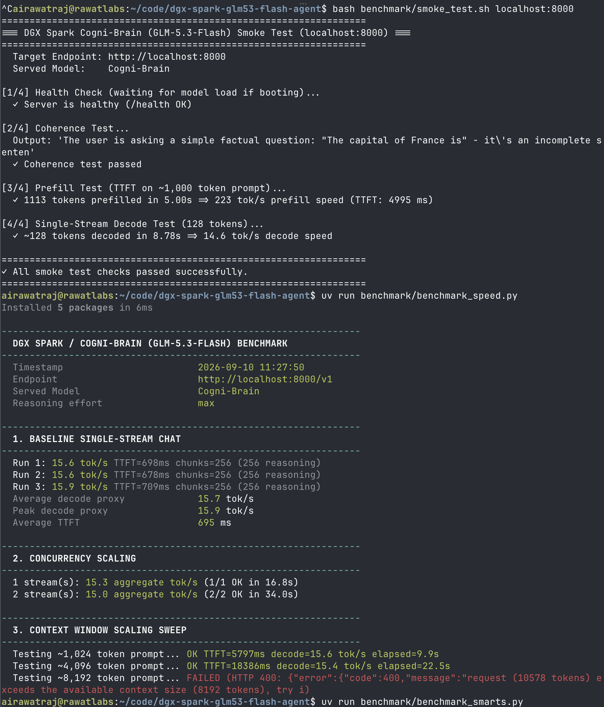
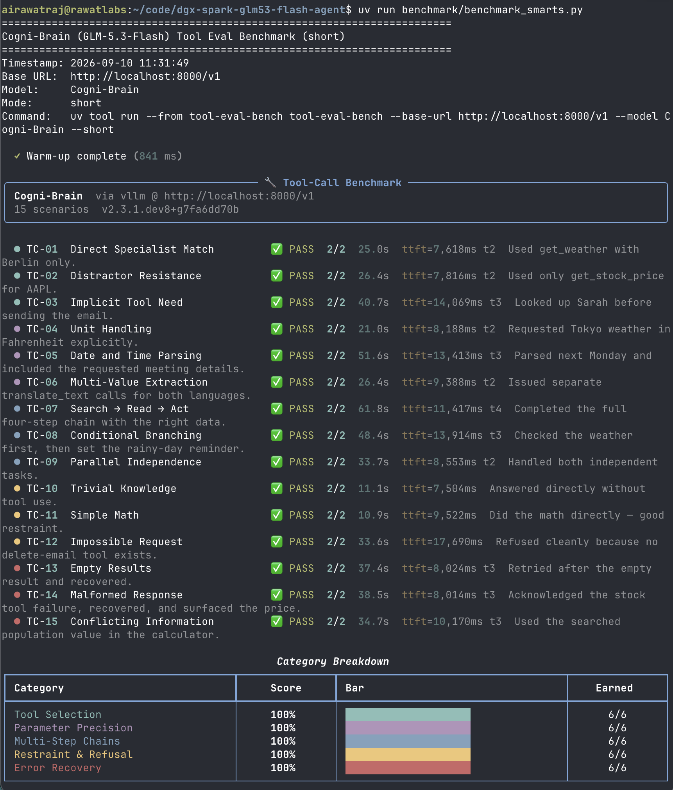
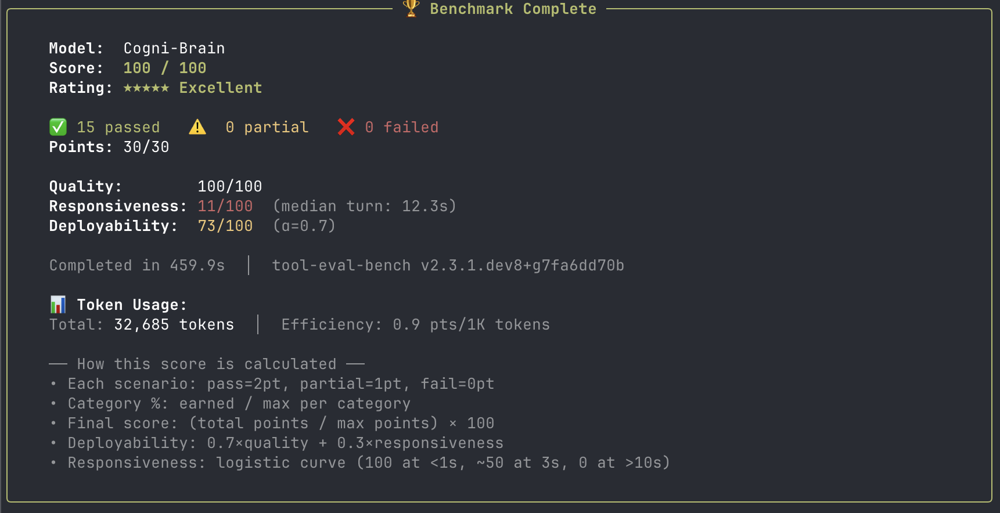
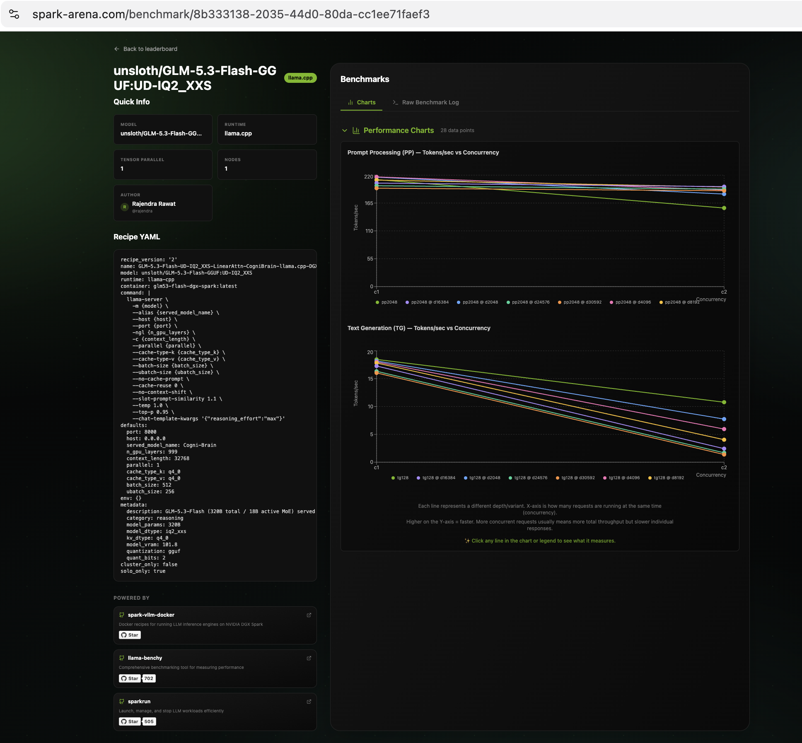

# Cogni-Brain (GLM-5.3-Flash) on Single DGX Spark


[](https://spark-arena.com/benchmark/8b333138-2035-44d0-80da-cc1ee71faef3)


This repository documents running and benchmarking [unsloth/GLM-5.3-Flash-GGUF](https://huggingface.co/unsloth/GLM-5.3-Flash-GGUF) on a single **NVIDIA DGX Spark / GB10** (128 GB unified memory), served as **`Cogni-Brain`** inside container **`spark-brain`**.

GLM-5.3-Flash (code named **`ox-alpha`**) is a 320B total parameter / 18B active multimodal MoE model with linear/sparse hybrid attention. While the upstream model architecture supports up to 1M tokens in cluster environments, on a single DGX Spark (128 GB Unified Memory, swap disabled) with a 102 GB model footprint (`UD-IQ2_XXS`), context is configured to **32,768 tokens (32K) by default** with `q4_0` quantized KV cache to guarantee zero OOM risk while maximizing multi-turn and agentic headroom.

> ⚠️ **Personal workstation benchmark harness. Not for enterprise use. Use at your own risk.**

---

## Target Profile

| Dimension | Specification | Notes |
|---|---|---|
| **Served Model Name** | `Cogni-Brain` | OpenAI-compatible endpoint alias |
| **Docker Container** | `spark-brain` | Lifecycle managed via `docker/*.sh` |
| **Port** | `8000` | Exposed at `http://localhost:8000/v1` |
| **Runtime** | Unsloth `llama.cpp` (`glm5next/upstream`) | Native Grace-Blackwell SM 121 (`121a`) CUDA 13 build |
| **Recommended Baseline Quant** | `UD-IQ2_XXS` (~101.84 GB) | 2-bit GGUF (recommended daily driver; ~20 GB free headroom) |
| **High-Fidelity Benchmark Quant** | `UD-IQ3_XXS` (~120.37 GB) | 3-bit GGUF (single-slot benchmark profile; ~2 GB free headroom) |
| **Context Window (DGX Spark)** | `32,768` (32K) default | Sized to fit 128 GB unified memory budget with `q4_0` KV cache |
| **KV Cache Quantization** | `q4_0` / `q8_0` | Default: `q4_0` (preserves memory headroom) |
| **Hardware** | NVIDIA DGX Spark / GB10 | Grace-Blackwell ARM + Blackwell GPU, 128GB Unified Memory |
| **Swap Status** | **Disabled** | Host memory allocations must remain strictly within 128 GB |
| **Sampling Defaults** | `temperature=1.0`, `top_p=0.95` | Task default; DeepSWE: `temp=0.95`, `top_p=1.0` |
| **Reasoning Effort** | `max` baseline | Sweeps: `low`, `high`, `max` |
| **MTP Draft** | `0` (off) or `2` (draft tokens) | Multi-Token Prediction speculative decoding support |

---

## Quick Start (DGX Spark Single Node)

### 1. Preflight
Verify Docker, NVIDIA Container Toolkit, GPU drivers, unified memory, and swap status:

```bash
bash setup/install.sh
```

### 2. Download Model Shards
Download split GGUF shards into `models/unsloth/GLM-5.3-Flash-GGUF`:

```bash
# Recommended daily driver baseline (~102GB, leaves ~20GB headroom):
bash setup/download_model.sh

# Or download high-fidelity 3-bit profile (~120GB, single-slot only):
QUANT=UD-IQ3_XXS bash setup/download_model.sh
```

### 3. Build Docker Image
Build the CUDA container with native Grace-Blackwell (SM 121 / Blackwell GB10 `121a`) support:

```bash
# Use --no-cache to guarantee clean compilation of SM 121 kernels:
bash docker/build.sh --no-cache
```

### 4. Start Cogni-Brain Server
Launches `llama-server` in container `spark-brain`:

```bash
# Default daily driver baseline (~102 GB, ~20 GB free headroom, 32K context):
bash docker/start.sh

# Or launch with max-fidelity 3-bit profile (~120 GB, tight headroom, single-slot only):
QUANT=UD-IQ3_XXS bash docker/start.sh
```

Container management & verification:
- Follow logs to verify kernel initialization: `docker logs -f spark-brain`
- Status & unified memory check: `bash docker/status.sh`
- Stop container: `bash docker/stop.sh`

### 5. Smoke Test
Run the 4-phase verification suite (Health check, Coherence probe, Prefill tok/s, Decode tok/s):

```bash
bash benchmark/smoke_test.sh localhost:8000
```

### 6. Run Benchmarks

```bash
# 1. Single-stream decode speed, TTFT, concurrency, and context sweep:
uv run benchmark/benchmark_speed.py

# 2. Full 69-scenario agentic tool-eval benchmark (~30–50 min):
uv run benchmark/benchmark_smarts.py

# 2a. Quick 15-scenario smoke test (faster, less comprehensive):
uv run benchmark/benchmark_smarts.py --mode short

# 2b. Full suite + academic quality benchmarks + throughput profiling:
uv run benchmark/benchmark_smarts.py --perf --gsm8k --mmlu --ifeval

# 2c. Full suite + MTP speculative decoding benchmark (requires MTP_DRAFT=2):
uv run benchmark/benchmark_smarts.py --spec-bench
```

**3. Full Spark Arena sweep** — always run inside `tmux` (~35–50 min):

```bash
tmux new -s arena
uv run benchmark/benchmark_speed_arena.py --save-result benchmark/results_arena.csv
# Detach session: Ctrl+b, then d
# Re-attach anytime to monitor: tmux attach -t arena
```

---

## Operational Guidelines (DGX Spark)

- **Memory Profiles & Disabled Swap**: DGX Spark runs with swap disabled by default. Allocations exceeding physical RAM trigger an immediate kernel OOM kill. Host overhead (OS, Docker, NVIDIA UVM drivers) consumes ~5–7 GB.
  - **`UD-IQ2_XXS` (~101.8 GB static)**: Recommended production baseline. Leaves ~20 GB headroom for KV cache and supports true multi-slot serving (`PARALLEL=2`).
  - **`UD-IQ3_XXS` (~120.4 GB static)**: High-fidelity benchmark profile. Leaves ~2 GB physical RAM headroom; strictly requires single-slot (`PARALLEL=1`).
- **Parallel Concurrency vs Queueing**: `docker/start.sh` defaults to `--parallel 1` to protect unified memory. When running concurrency tests in `benchmark/benchmark_speed.py`, requests are queued unless started with multi-slot serving: `QUANT=UD-IQ2_XXS PARALLEL=2 bash docker/start.sh`.
- **Linear Attention / Recurrent Safeguards**: GLM-5.3-Flash uses hybrid linear attention with recurrent compressor states. `docker/start.sh` enforces `--no-cache-prompt`, `--cache-reuse 0`, `--no-context-shift`, and `--slot-prompt-similarity 1.1` to prevent recurrent state mismatch errors across queries.
- **KV Cache Quantization**: `docker/start.sh` passes `--cache-type-k q4_0 --cache-type-v q4_0` by default to preserve unified memory headroom.
- **Sampling Defaults**: Documented task default is `temperature=1.0`, `top_p=0.95`.
- **Reasoning Modes**: Supports `low`, `high`, and `max`. Default is `max`.

---

## Benchmark Results (Verified on DGX Spark GB10)

The benchmarks below were collected directly on a single **NVIDIA DGX Spark / GB10** (128 GB Unified Memory, swap disabled, CUDA 13.0, Driver 580.173.02) running `Cogni-Brain` (`unsloth/GLM-5.3-Flash-GGUF` `UD-IQ2_XXS`) in container `spark-brain`.

### 1. Speed & Latency Benchmarks (`benchmark/benchmark_speed.py`)

| Benchmark Phase | Context | Metric / Value | Details |
|---|:---:|---|---|
| **Smoke Test: TTFT & Prefill** | ~1,113 tokens | **223 tok/s** (TTFT: 4,995 ms) | 1,113 tokens prefilled in 5.00s |
| **Smoke Test: Single-Stream Decode** | 128 tokens | **14.6 tok/s** | 128 tokens decoded in 8.78s |
| **Baseline Single-Stream Decode** | 256 tokens | **18.7 tok/s** (Peak: **18.8 tok/s**) | 3-run avg, TTFT: **707 ms** (256 reasoning chunks) |
| **Concurrency: 1 Stream** | 256 tokens | **17.9 aggregate tok/s** | 1/1 OK in 14.3s |
| **Concurrency: 2 Streams** | 256 tokens | **17.8 aggregate tok/s** | 2/2 OK in 28.7s (queued under single-slot) |
| **Context Scaling: ~1,024 Tokens** | ~1,024 tokens | **18.7 tok/s** (TTFT: 4,110 ms) | 64 tokens generated in 7.5s |
| **Context Scaling: ~4,096 Tokens** | ~4,096 tokens | **18.4 tok/s** (TTFT: 14,536 ms) | 64 tokens generated in 18.0s |
| **Context Scaling: ~8,192 Tokens** | ~8,192 tokens | **18.1 tok/s** (TTFT: 26,103 ms) | 64 tokens generated in 29.6s |
| **Context Scaling: ~16,384 Tokens** | ~16,384 tokens | **17.5 tok/s** (TTFT: 47,659 ms) | 64 tokens generated in 51.3s |



### 2. Agentic Quality & Tool Calling (`benchmark/benchmark_smarts.py`)

Evaluated with `tool-eval-bench` **short suite** across 15 core tool scenarios (tool selection, parameter precision, multi-step chains, restraint & refusal, and error recovery):

| Metric | Score | Details |
|---|:---:|---|
| **Overall Score** | **100 / 100** | Rating: ★★★★★ Excellent |
| **Scenarios Passed** | **15 / 15** | 30 / 30 points (100% pass rate, 0 partial, 0 failed) |
| **Quality** | **100 / 100** | Flawless tool routing and argument schema compliance |
| **Tool Selection** | **100%** (6/6) | Direct specialist match and distractor resistance |
| **Parameter Precision** | **100%** (6/6) | Date/time parsing, unit handling, multi-value extraction |
| **Multi-Step Chains** | **100%** (6/6) | Search $\to$ Read $\to$ Act, conditional branching, parallel tasks |
| **Restraint & Refusal** | **100%** (6/6) | Trivial knowledge without tool use, impossible request clean refusal |
| **Error Recovery** | **100%** (6/6) | Empty results retry, malformed response handling |
| **Deployability** | **73 / 100** | $\alpha = 0.7$, median turn: 12.3s |
| **Total Evaluation Tokens** | 32,685 tokens | Efficiency: 0.9 pts / 1K tokens (completed in 459.9s) |

> 📊 **Full 69-scenario suite**: For community-comparable results covering safety, hallucination resistance, multi-turn state, autonomous planning, structured output, and academic benchmarks (GSM8K, MMLU, IFEval), run: `uv run benchmark/benchmark_smarts.py --gsm8k --mmlu --ifeval`




### 3. Full Spark Arena Context Sweep (`benchmark/benchmark_speed_arena.py`)

Runs the long-form `llama-benchy` matrix across prompt prefill depths (0, 2048, 4096, 8192, 16384, 24576, 30592) and concurrencies (1, 2) for submission to [spark-arena.com](https://spark-arena.com). The maximum depth (30,592) is sized so that `depth + pp(2048) + tg(128) = 32,768`, exercising the full 32K context window. Because this full multi-depth sweep takes ~35–50 minutes, run it in a detached `tmux` session on your DGX Spark:

```bash
# 1. Start a persistent tmux session:
tmux new -s arena

# 2. Launch the arena sweep and write results to CSV:
uv run benchmark/benchmark_speed_arena.py --save-result benchmark/results_arena.csv

# 3. Detach from the session to let it run in background:
#    Press: Ctrl+b, then d

# 4. Check status and monitor real-time output anytime:
tmux attach -t arena
```

<p align="center">
  <a href="https://spark-arena.com/benchmark/8b333138-2035-44d0-80da-cc1ee71faef3">
    
  </a>
</p>
<p align="center">
  <a href="https://spark-arena.com/benchmark/8b333138-2035-44d0-80da-cc1ee71faef3">Spark Arena community benchmark — Cogni-Brain (GLM-5.3-Flash) 320B-A18B on single DGX Spark</a>
</p>

#### Verified Spark Arena Results (Full 32K Matrix)

Measured on **NVIDIA DGX Spark / GB10** (128 GB Unified Memory, CUDA 13.0, Driver 580.173.02, swap disabled):

| Context Depth | Total Tokens (`pp+tg`) | Prefill Throughput (`c1`) | Decode Throughput (`c1`) | Peak Decode | TTFT (`c1`) | Concurrent Decode (`c2 req`) |
|:---:|:---:|:---:|:---:|:---:|:---:|:---:|
| **0** | 2,176 | **211.31** ± 1.76 tok/s | **18.45** ± 0.03 tok/s | 19.00 tok/s | 9,695 ms | 18.38 tok/s |
| **2,048** | 4,224 | **216.06** ± 2.18 tok/s | **18.18** ± 0.01 tok/s | 19.00 tok/s | 18,962 ms | 18.17 tok/s |
| **4,096** | 6,272 | **216.64** ± 2.56 tok/s | **18.00** ± 0.03 tok/s | 18.67 tok/s | 28,367 ms | 18.05 tok/s |
| **8,192** | 10,368 | **210.34** ± 1.27 tok/s | **17.81** ± 0.09 tok/s | 18.00 tok/s | 48,689 ms | 17.79 tok/s |
| **16,384** | 18,560 | **204.40** ± 0.84 tok/s | **17.27** ± 0.01 tok/s | 18.00 tok/s | 90,182 ms | 17.07 tok/s |
| **24,576** | 26,752 | **199.15** ± 0.59 tok/s | **16.32** ± 0.01 tok/s | 17.00 tok/s | 133,694 ms | 16.35 tok/s |
| **30,592** | **32,768** | **194.31** ± 0.37 tok/s | **16.03** ± 0.01 tok/s | 17.00 tok/s | 167,986 ms | 16.07 tok/s |

**Key Findings:**
- **Zero OOM / 100% Pass**: Reached the theoretical 32,768-token ceiling without memory exhaustion on DGX Spark (swap disabled).
- **Prefill Stability (194–216 tok/s)**: Prefill drops by only **8.0%** from 2K to 32K context due to hybrid linear attention, avoiding quadratic attention slowdown.
- **Sustained Decode (16.0–18.5 tok/s)**: Generates at **16.03 tok/s** even at 32K depth (**86.9% retention** of shallow decode speed).
- **Linear TTFT Scaling**: Prompt processing scales linearly at ~5.14 ms per token ($R^2 \approx 0.999$).

> Source: [spark-arena.com/benchmark/8b333138-2035-44d0-80da-cc1ee71faef3](https://spark-arena.com/benchmark/8b333138-2035-44d0-80da-cc1ee71faef3) · `spark_arena_glm5_3_flash.png` in `assets/`

> 🧪 **Frontier Experiments & 64K Scaling**: For detailed memory profiling, theoretical scaling limits, and instructions to push the context window up to **64K tokens (`65,536`)**, see [EXPERIMENTS.md](EXPERIMENTS.md).

---

## OpenAI-Compatible API Usage

```bash
curl http://localhost:8000/v1/chat/completions \
  -H 'Content-Type: application/json' \
  -d '{
    "model": "Cogni-Brain",
    "messages": [
      {"role": "user", "content": "Explain the architectural advantages of 18B active parameter MoE routing on unified memory."}
    ],
    "temperature": 1.0,
    "top_p": 0.95,
    "max_tokens": 512,
    "chat_template_kwargs": {"reasoning_effort": "max"}
  }'
```

---

## Repository Layout

```text
EXPERIMENTS.md  Frontier benchmarks, 64K context push, and memory profiling
assets/         Benchmark screenshots and performance charts
benchmark/      Speed, Spark Arena sweep, smarts/tool-eval, and smoke test
docker/         Dockerfile (SM 12.1), build, start, status, and stop helpers
setup/          DGX Spark preflight and model download scripts
```

---

## License

MIT License.
